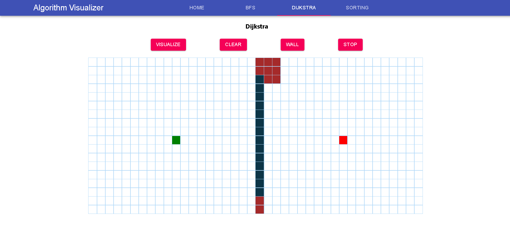
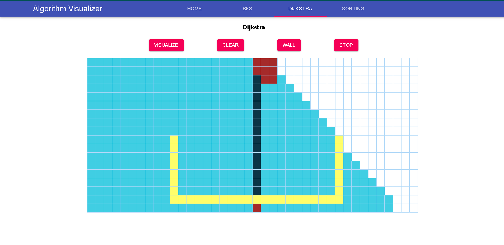
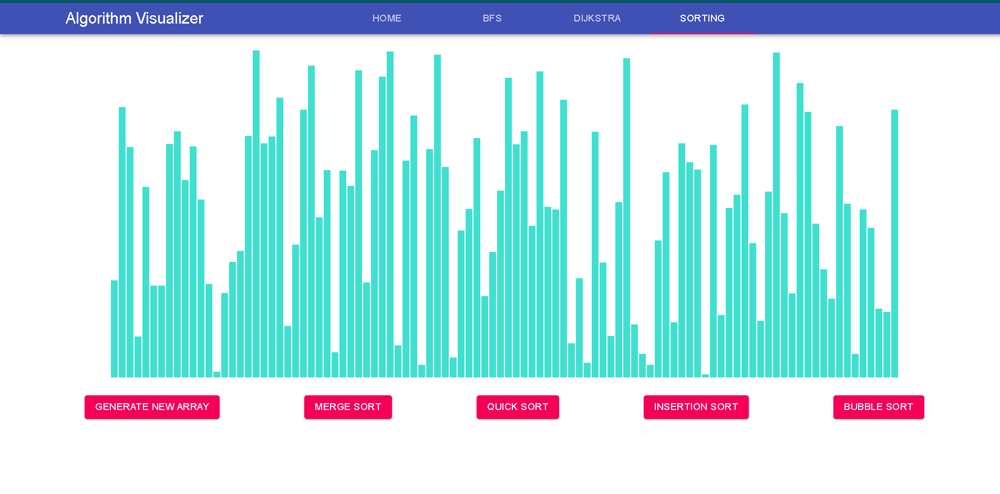
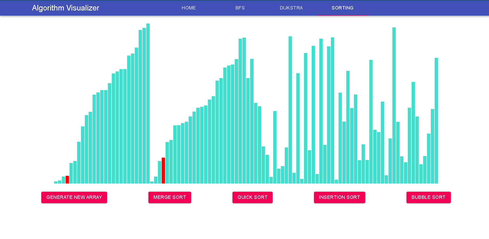
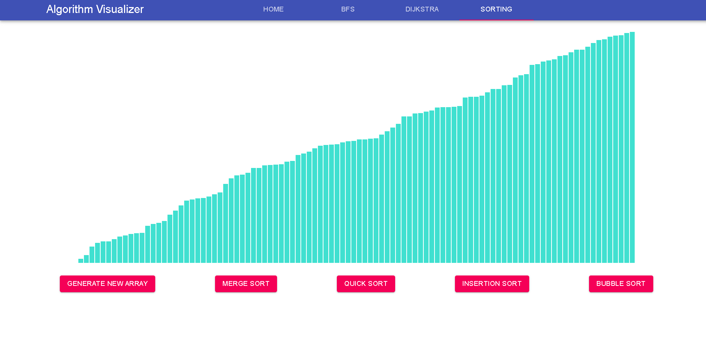

# Algorithm-Visualizer
> This is a capstone Project. The app focuses on visualization of some widely used algorithms.

1. BFS
2. Dijkstra's Algorithm
3. Insertion Sort
4. Merge Sort
5. Bubble Sort

It is a work in progess and many more algorithms will be added in the future.

## Contributors 
* [Arpit Sodani](https://github.com/arpitsodani15)
* [Lakshit Jain](https://github.com/jain-lakshit)

### The project is deployed at - [Algorithm Visualizer](https://algorithm-visualizer-9c27e.web.app/) . Check it out!!

## Screenshots

